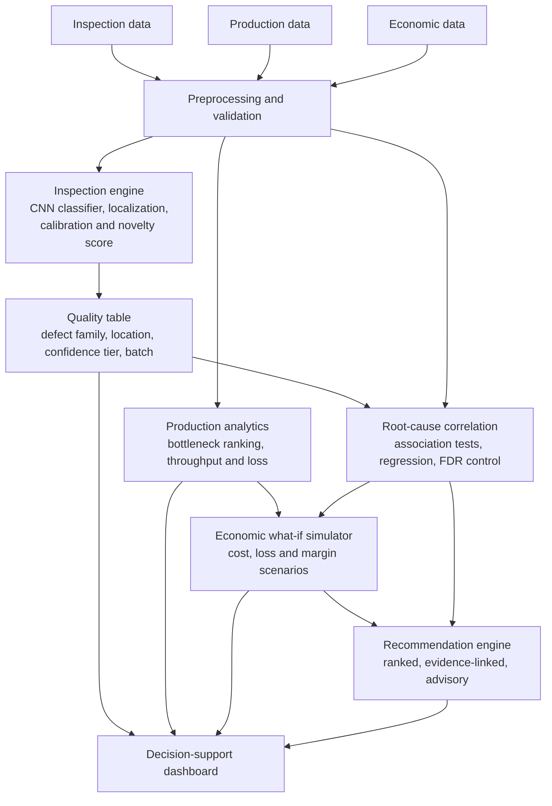

<div align="center">

# Visual Inspection & Defect Root-Cause Assistant

### NeuraX Hackathon 3.0 · Domain 2: AI in Industry and Automation

**From defect detection to process intelligence and economic impact.**

</div>

---

## 1. Problem Understanding

On a fast production line, quality, output, and profit are all connected — a problem in one affects the others. Even small issues like a hard-to-spot defect, an unbalanced work station, machine drift between batches, or a slow changeover can quietly reduce both production speed and profit.

**Primary user:** a quality or process engineer. Today they can see that defects are rising, but they struggle to say *which* defect family, *where* on the product, *which* batch or process condition is associated with it, and *what it costs*, because the evidence sits in separate tools.

### The Gap

Existing workflows can flag a defective unit, but the result stays disconnected from process analysis, production bottlenecks and economic impact. An inspection model, a KPI dashboard and a cost sheet each answer one question. Nobody connects them.

### Our Objective

Build a decision-support system that connects:

**Defect → Evidence → Process/Batch Pattern → Bottleneck → Loss → Economic Impact → Recommended Investigation**

### What the system answers

| Question | Output |
|---|---|
| What is wrong with this unit? | Accept or defect, defect family, confidence tier |
| Where is the defect? | Heatmap, box or mask on the image |
| Which process condition is linked to it? | Batch and process associations with effect size and confidence |
| Where is the line constrained? | Ranked bottleneck stations |
| What does it cost? | Throughput loss, scrap and rework cost, margin scenarios |
| What should we investigate next? | Ranked advisory recommendations with evidence |

### Success criteria

Targets are set against a baseline once the data is inspected.

- Low false-reject and false-accept rates on **held-out batches**
- Localization that holds up on unseen samples
- Novel or unknown defects **flagged for review**, not forced into a known class
- **Calibrated** confidence, so "90% sure" means roughly 90%
- Every root-cause claim shown with evidence and labelled as association
- Inspection, bottleneck and margin impact in **one connected view**

---

## 2. Our Approach

We are not building another standalone defect classifier. Instead of:

**Image → Defect label**

we build:

**Image → Defect + Location + Confidence → Process Evidence → Production Impact → Economic Scenario**

Four choices set this system apart.

1. **An evidence chain from pixel to profit.** Every recommendation traces back through the bottleneck, the process evidence and the defect image behind it.
2. **Uncertainty first.** Every unit lands in one of three tiers: *classified*, *review required*, or *potential novel defect*. Unknown defects are never guessed.
3. **Cost-aware thresholds.** The accept/reject threshold is chosen to minimize expected cost, using the economic data to weigh a missed defect against a false reject, rather than to maximize accuracy.
4. **Association, not proven causation.** Root-cause links carry effect sizes and multiple-testing control, and are presented as contributing conditions.

### Method by component

| Component | Method | Why | Fallback |
|---|---|---|---|
| Data preparation | Validation, cleaning, batch-aware splits, augmentation for lighting, orientation and contrast | Robustness depends on unseen conditions | Simpler augmentation if compute is limited |
| Detection and classification | Pretrained CNN (EfficientNet or ResNet family), fine-tuned | Strong results with limited labels | Gradient boosting on extracted features if data is very small |
| Localization | Detection or segmentation where boxes or masks exist; Grad-CAM heatmaps otherwise | Works with or without localization labels | Anomaly-style patch heatmaps |
| Confidence and novelty | Temperature scaling for calibration, plus feature-space distance to known-class embeddings | Separates "confidently wrong" from "unfamiliar" | Max-softmax threshold |
| Root-cause correlation | Chi-square or ANOVA with effect sizes and Benjamini-Hochberg correction, then logistic regression across process variables | Avoids spurious links from testing many variables | Grouped defect rates per batch or parameter bin with confidence intervals |
| Bottleneck identification | Per-station utilization, cycle time, WIP, downtime and changeover analysis, ranked with theory-of-constraints logic | Explainable and quick to validate | Rule-based scoring |
| Throughput, loss and margin | Transparent what-if model: throughput limited by the constrained station, scrap and rework cost from defect rates, margin from cost data. Shown as low, base and high scenarios | Keeps simulated results separate from observed ones | Deterministic spreadsheet-style calculation |
| Recommendations | Deterministic ranking of investigations by simulated margin gain and strength of evidence | Reproducible and defensible | Fixed rule templates |

<!-- OPTIONAL if time allows: SHAP for multi-factor root-cause explanation -->

**All interventions and profit figures are simulated or advisory.** The system has no camera feed, PLC link or machine control.

---

## 3. System Architecture



| Layer | Technology |
|---|---|
| Frontend | React, Vite, Tailwind CSS, Recharts |
| Backend | Python, FastAPI |
| ML and vision | PyTorch, torchvision, OpenCV, scikit-learn |
| Statistics | SciPy, statsmodels |
| Data | Pandas, NumPy, SQLite for processed results |
| Reproducibility | Git and GitHub, pinned dependencies, fixed seeds, one-command pipeline run |

<!-- CONFIRM after data inspection: framework (PyTorch), whether boxes/masks exist -->

---

## 4. Data

The system is built around the **organizer-provided inspection, production and economic datasets** specified by the problem statement.

- The exact fields, labels and relationships are confirmed after data inspection. We do not assume variables or annotations that are not present.
- Where a layer lacks labels (for example, no box or mask annotations), we use the stated fallback method and report which one was used.
- Inspection results are joined to batch, process and production data through shared identifiers, preserving traceability from a defect to the evidence behind it.

```text
Inspection results → Defect patterns → Process / batch context
      → Production constraints → Throughput and loss → Economic scenario → Recommendation
```

---

## 5. Evaluation Plan

All splits are **by batch**, so no batch appears in both training and testing and scores reflect unseen conditions.

| Evaluation area | Evidence / metric | Protocol |
|---|---|---|
| Detection and classification | Precision, recall, F1 per class, confusion matrix | Held-out batches |
| False accept / reject | FAR, FRR, cost-weighted threshold sweep | Threshold chosen on validation, reported on test |
| Localization | IoU or mAP where annotations exist; heatmap overlap otherwise | Unseen samples only |
| Robustness | Drop in performance under lighting, orientation and batch shifts | Synthetic shifts and real held-out batches |
| Novel defects | Novelty AUROC, share of unseen types flagged instead of misclassified | Leave-one-defect-class-out test |
| Confidence | Expected calibration error, reliability diagram, accuracy versus review rate | Validation set, checked on held-out batches |
| Root-cause correlation | Effect size, adjusted p-values, stability across bootstrap and batch splits | Reported as association with limits |
| Bottleneck analysis | Cycle time, utilization, WIP, throughput | Compared against station-level ground truth where available |
| Economic analysis | Transparent what-if calculations with low, base and high scenarios | Assumptions listed next to every figure |
| Technical reliability | End-to-end runtime, identical results on fixed-seed reruns | One-command reproduction |
| UI/UX | Evidence, trends and impact visible in one view | Walkthrough of the full defect-to-recommendation flow |

---

## 6. Limitations

- Model performance depends on the available data and its coverage of real conditions.
- Novel conditions are flagged as uncertain and need further validation. They are not assumed to be classified correctly.
- Statistical correlation does not establish causation.
- Economic outputs are scenario estimates built on stated assumptions, not guaranteed outcomes.
- Localization quality depends on the annotation format available, and we state which method was used.
- The prototype is decision support only and never controls manufacturing equipment. Final decisions stay with human experts.

---

## 7. Roadmap

| Checkpoint | Deliverable |
|---|---|
| CP1 | Research, problem understanding, architecture and technical approach (this document) |
| CP2 | Working partial pipeline: baseline classifier with heatmap and confidence tiers, bottleneck ranking, first margin scenario, dashboard skeleton |
| CP3 | Validated detection, localization and robustness, novelty handling, calibration, root-cause correlation, cost-aware thresholds, integrated dashboard and evaluation report |

**Beyond the prototype:** connect to data from one real line as a pilot, then extend to more lines, products and defect types with the same pipeline and human review of recommendations.

---

## 8. Project Setup

```text
NeuraX/
├── frontend/     # Decision-support dashboard
├── backend/      # FastAPI services
├── ml/           # Inspection, correlation and simulation pipeline
├── data/         # Organizer data
├── docs/         # Evaluation report and notes
├── requirements.txt
├── .env.example
└── README.md
```

```bash
# Install
pip install -r requirements.txt
cd frontend && npm install && cd ..

# Run the pipeline, then the services
python -m ml.run_pipeline --data data/
uvicorn backend.main:app --reload
cd frontend && npm run dev
```

<!-- UPDATE these commands once the code exists so they match the real entry points -->

Seeds, dependency versions and data-processing steps are fixed in the repository so the demonstrated results can be reproduced.

---

## Core Principle

> **Don't just detect what went wrong. Connect the evidence to the process, quantify the impact, and help the engineer decide what to investigate next.**
